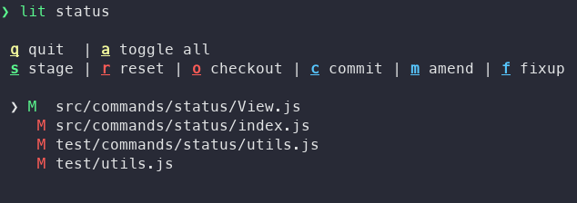

Lit
===

> Interactive git tools

Lit is a set of interactive git tools that aims to automate tedious git tasks.

## Installation
`npm i -g @heruka_urgyen/lit`

## Usage
`lit [--help] <command>`

## Commands

### Status
Usage: `lit status`.

Git status with interactive cli for selecting files. It provides operations, such as _stage_, _reset_, _checkout_, _commit_, _commit --amend_ and _commit --fixup_. The last one will open git log to select a commit for fixup.

## License
GPL-3.0
